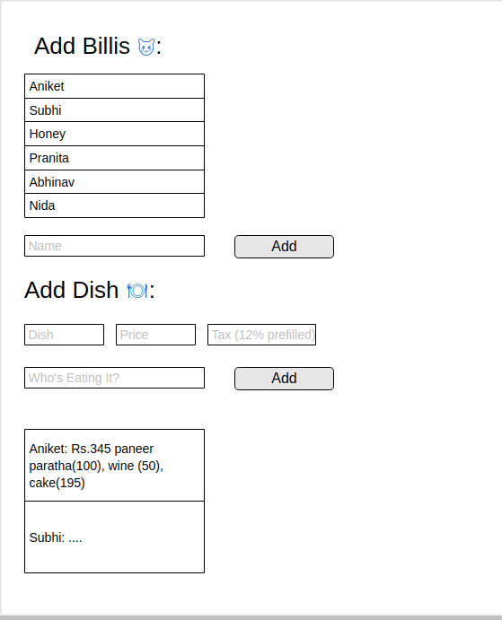

# billy बिल्ली
A project to help me teach good programming practises to anyone who wants to learn. It's for restauraunt bill sharing between friends that takes tax etc into account.

So go ahead and write this as an app or website or whatever and follow just one principle to begin with:

1. Your logic for calculating should not be in the same class as your view code.

For Android this means no logic code in your Activity class. Create one new class in which all your calculating functions for this screen are put. Create an object of that class in your view class and call its functions there.

You can adapt the idea for whatever you're using.

## The problem we're solving:
Say you're at a restauraunt, you went there with your friends, some of you ordered drinks, some didn't. Some ordered food, some didn't. People generally did their own thing.

Now it's time to pay the bill and how you split it? Even if you wanted to pay for what you had, that usually doesn't take tax into account. Someone's going to pay more and others less. If you had (some) cheesesticks you wouldn't want to be splitting with three large pizzas.

How do you do it?

Introducing बिल्ली which is pronounced "billy" like the American name but means 'Cat' in Hindi. 

First add names. Then add each food item someone orders along with the tax percentage.

Calibrated for Indian Goods and Services Tax, it's at 12% for food (set by default into the edit text) and can vary for alcoholic drinks.

## How it looks
[Here's](https://app.moqups.com/8uTlXiNbGX/edit/page/ad64222d5) a mockup, and here's the idea I had for it.
People
 -> Who buy stuff
 	-> which has a price
 		-> and a tax

Add persons:

List of people

Name: _____

\[add button\]

Add dish:

Name:_____

Price:_____

Tax: ____ \(default tax populated\)

Persons:(dropdown or chips)

\[add button\]

List of each person and how much they owe.

Fun fact, emoji's are just text so you can easily add them to your textviews.

Note: Since "billi" is cat in hindi but also sounds like billee, meaning, the person paying the bill, I describe the people paying the bill as billee's, hence the emoji's 🐱

